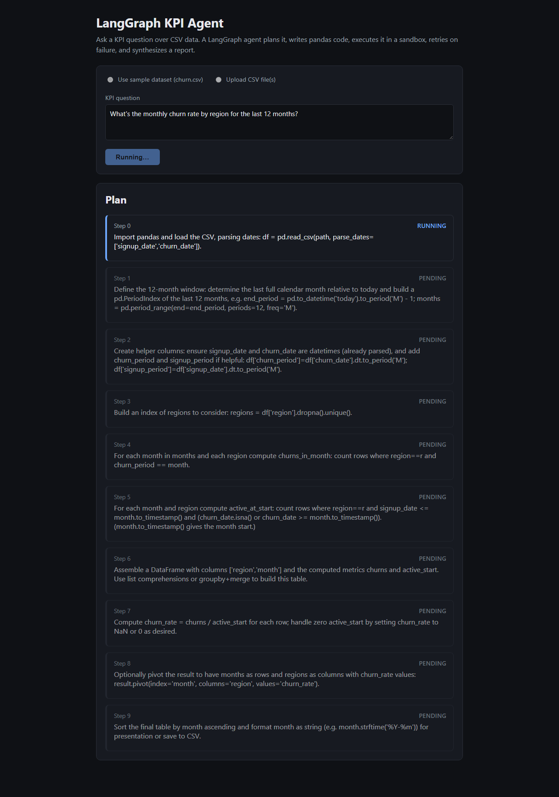

# LangGraph KPI Agent

A recursive, code-writing KPI agent built with [LangGraph](https://langchain-ai.github.io/langgraph/): give it one or more CSVs and a natural-language KPI question, and it plans the analysis into sub-steps, writes pandas code for each step, executes it in a sandboxed subprocess, retries on failure by feeding the error back to the model, and synthesizes a final report once every step succeeds.



This started as a learning project to build hands-on intuition for LangGraph's `StateGraph` (explicit typed state, conditional edges, checkpointing) as an alternative to a hand-rolled "shared mutable context + while loop" agent pattern.

## How it works

```
planner -> coder -> executor -> [router]
                                   -> coder        (retry same step, on error)
                                   -> advance_step  -> coder   (next step, on success)
                                   -> finalizer     (all steps done)
                                   -> failure       (max retries exceeded)
```

- **`planner`** (LLM) breaks the question into an ordered list of sub-steps.
- **`coder`** (LLM) writes pandas code for exactly one step, given the prior steps' results and — on a retry — the previous code attempt plus its error.
- **`executor`** runs that code in an isolated Python **subprocess** (not in-process `exec()`), with a timeout and a stripped environment (no inherited secrets like the Azure API key), and a throwaway working directory so anything the code writes to disk doesn't leak into the repo.
- **`router`** is a plain, pure, unit-tested Python function — not an LLM call — deciding retry / advance / finish / fail from the current state.
- **`finalizer`** (LLM) synthesizes a final report from all the steps' results.
- Optional **checkpointing** (LangGraph + SQLite) lets a run be paused and resumed later from exactly where it left off, keyed by a `thread_id`.

## Repo layout

```
src/            the LangGraph agent itself (state, nodes, router, graph, sandboxed executor, LLM client)
backend/        FastAPI wrapper exposing the agent over HTTP + Server-Sent Events
frontend/       Angular UI (standalone components, signals) that drives a run and streams live progress
scripts/        manual smoke scripts (end-to-end run, checkpoint pause/resume demo)
tests/          pytest suite for the agent, sandbox, and API serialization (no LLM calls, no cost)
data/           bundled sample dataset used by the UI's "use sample dataset" option
```

### Sample dataset

`data/superstore.csv` is Tableau's classic "Sample - Superstore" dataset — the de facto standard practice dataset used across the BI/analytics world (order-level retail data: dates, US regions, product categories, sales, profit). It's realistic synthetic retail data rather than a live production export, but unlike a hand-generated file it has genuine, independently-recognizable structure and is a known quantity for anyone reviewing this project.

## Setup

### Backend (Python)

Requires Python 3.11+ and an Azure AI Foundry / Azure OpenAI deployment.

```bash
python -m venv .venv
.venv/Scripts/activate        # .venv/bin/activate on macOS/Linux
pip install -r backend/requirements.txt

cp .env.example .env          # then fill in AZURE_API_KEY, AZURE_API_BASE, MODEL_NAME
```

`.env` uses these variables (see `.env.example`):

| Variable | Meaning |
|---|---|
| `AZURE_API_KEY` | Your Azure AI Foundry / Azure OpenAI API key |
| `AZURE_API_BASE` | The endpoint base URL (e.g. `https://<resource>.openai.azure.com/` or a Foundry `/openai/v1` endpoint) |
| `MODEL_NAME` | The deployment name to call |
| `AZURE_API_VERSION` | Optional; only needed for the classic Azure OpenAI endpoint shape |

Run the API:

```bash
python -m uvicorn backend.main:app --reload --port 8000
```

### Frontend (Angular)

Requires Node 18+.

```bash
cd frontend
npm install
npm start          # ng serve, http://localhost:4200
```

Open `http://localhost:4200`, pick "use sample dataset" or upload your own CSV(s), ask a KPI question, and watch the plan, code, and results stream in live.

### Running the agent without the UI

```bash
python scripts/smoke_e2e.py         # full run against the sample dataset, prints the final report
python scripts/checkpoint_demo.py   # run it once to pause, run it again to resume from the checkpoint
```

### Tests

```bash
pip install -r requirements-dev.txt
pytest tests/ -v
```

The suite (21 tests) covers the router's retry/advance/finish/fail decision, the sandboxed executor (success, exceptions, timeouts, secret isolation, the throwaway-cwd fix), and the backend's SSE JSON serialization — none of it makes a real LLM call, so it's fast and free to run.

## Design notes and known limitations

- **Sandboxing is subprocess + timeout + stripped env, not a container.** It isolates crashes, infinite loops, and secrets, but not the filesystem or network — generated code can still read/write any file the OS user can via an absolute path. A Docker-based executor would close that gap at the cost of needing Docker available and added latency per step.
- **Retries only catch exceptions, not silently-wrong-but-successful code.** If a step runs cleanly but produces incomplete or incorrect results (e.g. a loop that only appends one row instead of twelve), the router sees `error = None` and advances — there's no step-level correctness check.
- **The SSE stream doesn't support reconnection or client-disconnect cancellation.** If a client disconnects mid-run, the run keeps executing on the server rather than being cancelled.
- **The run registry is in-memory, single-process.** Fine for a local/demo deployment; a real deployment would need persistent, multi-worker-safe run storage.

## What this is for

Built and documented as prep for discussing LangGraph in an interview context — see the spec doc for the full "why this design" rationale, including how each piece compares to a hand-rolled agent loop.
